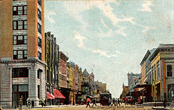
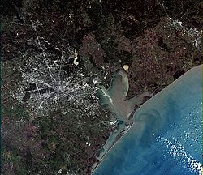
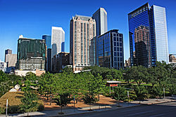
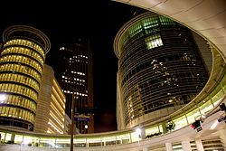
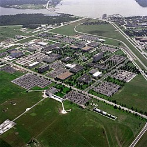
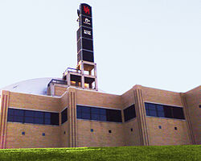

<link rel="stylesheet" href="https://stackpath.bootstrapcdn.com/bootswatch/4.5.2/sketchy/bootstrap.min.css" integrity="sha384-RxqHG2ilm4r6aFRpGmBbGTjsqwfqHOKy1ArsMhHusnRO47jcGqpIQqlQK/kmGy9R" crossorigin="anonymous">

# Хьюстон
**Хьюстон** (англ. Houston) — четвёртый по количеству жителей город в Соединённых Штатах Америки и крупнейший город в штате Техас с населением 2 319 603 человека на 2017 год. Хьюстон является административным центром округа Харрис, а также главным экономическим центром агломерации Большого Хьюстона с общим населением 6 772 470 человек на 2016 год. Город располагается в 50 километрах от Мексиканского залива на прибрежной равнине.

Хьюстон был основан 30 августа 1836 года и включён в состав республики Техас 5 июня 1837 года, получив своё имя в честь Сэмюэла Хьюстона — главнокомандующего армией Техаса во время Техасской революции и президента Республики Техас. Быстрое развитие порта и железных дорог в XIX веке, а также начало добычи нефти и последовавшее развитие нефтяной промышленности в XX веке привели к быстрому росту населения. В 1960-е годы количество жителей превысило один миллион человек, а в 2000-е — два миллиона.

Город является ведущим мировым центром энергетической промышленности, а экономика города также представлена предприятиями в области аэронавтики, транспорта и здравоохранения. Важнейшими объектами для экономики и инфраструктуры города являются космический центр имени Линдона Джонсона, крупнейший американский по международным грузоперевозкам порт, хьюстонский судоходный канал, крупнейший в мире Техасский медицинский центр.

## Содержание
1. [История](#история)
    1. [Этимология, прозвища](#этимология)
    1. [Основание](#основание)
    1. [XX век](#хх)
1. [Физико-географическая характеристика](#характеристика)
    1. [Географическое положение и климат](#климат)
    1. [Рельеф, внутренние воды](#рельеф)
    1. [Флора и фауна](#фауна)
1. [Экономика](#экономика)
    1. [Общее состояние](#состояние)
    1. [Энергетика и нефтехимия](#нефтехимия)
    1. [Авиакосмическая промышленность](#промышленность)
1. [Население](#население)
    1. [Динамика и структура населения](#структура)
    1. [Этнический и конфессиональный состав, языки](#языки)
1. [Средства массовой информации](#средства)
1. [Города-побратимы](#города)    

##  История
###  Этимология, прозвища

Сэмюэл Хьюстон

Город назван в честь Сэмюэла Хьюстона — главнокомандующего армией Техаса во время Техасской революции (1835—1836) и президента Республики Техас (1836—1838, 1841—1844).

Официальное прозвище Хьюстона — «Space city», которое можно перевести, как «космический город», «город космонавтики» или «космоград». Название дано из-за того, что здесь находится космический центр имени Линдона Джонсона. Всего город имеет 12 прозвищ.

В американской разговорной речи есть популярная фраза: **«Хьюстон, у нас проблема»** (англ. Houston, we’ve had a problem), появившаяся после неудачной миссии Аполлон-13. В Хьюстоне проходили съёмки фильма «Аполлон-13», в основу сюжета которого легли реальные события миссии.

###  Основание

Allen’s Landing — место, где был основан город

После окончания войны за независимость Техаса, в августе 1836 года предприниматели братья Август и Джон Аллены купили 26,9 км2 земли вдоль реки Буффало-Байю, планируя основать на ней населённый пункт. Они хотели, чтобы будущий город стал столицей Техаса и крупным торговым центром.

Датой основания города принято считать 30 августа 1836 года, когда братья Аллены разместили объявление о появлении города. Город назвали в честь генерала Сэма Хьюстона, возглавлявшего
армию техасцев в битве при Сан-Хасинто во время войны против Мексики, позже избранного президентом Техаса. На январь 1837 года в посёлке проживало всего 12 человек, однако через четыре
месяца население возросло до 1 500 человек. 5 июня 1837 года город был включён в округ Гаррисберг (ныне Харрис) и стал временной столицей Республики Техас, которой оставался до 1839 года. 
Первым мэром Хьюстона стал Джеймс Холман.

###  XX век

Мэйн-Стрит в центре, 1908 год

В 1900 году на Хьюстон обрушился Галвестонский ураган, продолжавшийся с 27 августа по 12 сентября. В пересчете на сегодняшний курс ущерб составил бы $526 млн, погибло 8 тысяч человек. В следующем году было найдено большое месторождение нефти вблизи города Бомонт, что послужило началом развития нефтяной промышленности в Техасе. В 1902 году президент США Теодор Рузвельт утвердил проект стоимостью в $1 млн на реконструкцию хьюстонского судоходного канала. К 1910
году численность населения города достигла 78 800 человек, почти в два раза превысив количество жителей проживавших в Хьюстоне в 1900 году. В 1914 году президент США Вудро Вильсон принял
участие в открытии нового глубоководного порта Хьюстона, а через год был открыт хьюстонский судоходный канал. 

В 1945 году было начато формирование Техасского медицинского центра. В конце 1940-х несколько пригородов были включены в городскую черту, в результате чего площадь Хьюстона увеличилась
более чем в два раза. В 1950-е годы управления многих крупных (в основном нефтяных) компаний США переместились в Хьюстон, что благоприятно отразилось на экономике города, одним из
поводов для переезда послужило массовое оснащение всех офисов кондиционерами.

>Именно кондиционирование воздуха! Именно оно было основой для стремительного
роста Хьюстона в 1950 году, когда он стал наиболее оснащённым кондиционерами городом в мире. Именно это стимулировало многие корпорации переместить свои штаб-квартиры в Хьюстон.

В 1962—1964 годах в двадцати пяти милях к югу от центра Хьюстона, на землях, переданных федеральному правительству университетом Райса, был построен Центр управления космическими кораблями, с 1973 года носящий имя Линдона Джонсона. В 1960-х годах население Хьюстона достигло миллиона человек.
##  Физико-географическая характеристика
###  Географическое положение и климат

Хьюстон со спутника Landsat 7

Хьюстон расположен в 50 километрах от Мексиканского залива на прибрежной равнине. Значительная часть города была построена на лесных угодьях, болотах и прериях, они до сих пор сохранились в близлежащих районах около Хьюстона. Город расположен на территории, для которой обычны частые ливни и дожди, поэтому для Хьюстона наводнения — постоянная проблема. Высота города над уровнем моря в среднем 15 метров, самая высшая точка — северо-запад Хьюстона (38 метров). Площадь города составляет 1 552,9 км2.

Весной и летом в городе жарко и влажно: средняя температура весной 21 °C, а летом — 28,8 °C. Из-за высокой температуры почти во всех транспортных средствах и зданиях установлены кондиционеры. Абсолютный максимум температуры был зарегистрирован в 2000 и 2011 годах, когда она составила 42,8 °C. На Хьюстон часто обрушиваются ураганы, самые крупные из которых за последние десятилетия — «Эллисон» и «Айк». Осень — достаточно тёплое время года, особенно сентябрь. Температура в этом месяце выше, чем в мае. Средняя температура осенью составляет 21,8 °C, а среднее количество осадков — самое высокое в году (359,7 мм). Зима тёплая. Самая низкая температура была зарегистрирована в 1930 году — −15 °C. Средняя температура зимой составляет 12,6 °C, а максимальная была зарегистрирована в 1986 году — 32,8 °C. 18 дней в году температура опускается ниже 0 °C. Обычно зимой осадки выпадают в виде дождя, но редко могут быть и в виде снега. Начиная с 1895 года, снег падал 35 раз, причём 21 раз устанавливался временный снежный покров.

**Дни с ясной и дождливой погодой в месяц (суммарно по часам)**

--------------------------------------------------------------
|Месяц                 |Янв  |Фев  |Мар  |Апр  |Май  |Июн  |Июл  |Авг  |Сен  |Окт  |Ноя  |Дек  |Год  |
|----------------------|:---:|:---:|:---:|:---:|:---:|:---:|:---:|:---:|:---:|:---:|:---:|:---:|---:|
|**Солнечное сияние,день** |10   |10  |9   |8   |8   |8   |10  |9   |7   |7   |8   |9   |106 |
|**Дождь,день**            |14   |12  |12  |10  |10  |14  |13  |12  |10  |9   |10  |12  |136 |      

###  Рельеф, внутренние воды
Для почв Хьюстона характерно наличие осадочных горных пород и песка. На поверхности часты эрозии, на территории города находится около 300 разломов, их общая длина примерно 500 км. Один из них — Long Point–Eureka Heights fault system. Также есть уникальные отложения из смеси песков и глин, благодаря ним, через определённое время, из разлагающихся органических веществ образуются нефть и природный газ. На окраинах Хьюстона встречается чёрная плодородная почва, на которой растят рис, сою, зерновые культуры, овощи и разводят крупный рогатый скот, лошадей,свиней и домашнюю птицу. В городе и его окрестностях имеется очень малая вероятность сильного землетрясения, а самое сильное землетрясение магнитудой 3,8 было в 1910 году.

В Хьюстоне протекают четыре реки. Основная, Буффало-Байю, проходит через центр города и хьюстонский судоходный канал, и имеет три притока. Брес-Байю протекает вдоль района Техасского медицинского центра, Симс-Байю проходит через южную часть города, Уайт-Ок-Байю — через северную часть города. Судоходный канал следует дальше до Галвестона, вплоть до Мексиканского залива. В пригороде находятся два озера: Конро и Хьюстон, которые являются водохранилищем и служат городскими источниками воды. На территории города протекает множество подземных вод, которые раньше активно использовали для водоснабжения, но перестали из-за медленного движения земной поверхности.
###  Флора и фауна

Парк Discovery green в центре Хьюстона

В флоре и фауне округа Харрис преобладают виды животных и растений, обитающих в болотных местностях, так как значительная часть города построена на болотах и прериях.

Среди земноводных и пресмыкающихся наиболее известны хьюстонская жаба и техасская рогатая ящерица. Среди млекопитающих можно отметить рыжего волка, оцелота и канадскую выдру. Среди птиц замечаются американский клювач и белоголовый орлан. Численность большинства животных за последний век значительно сократилась в черте округа и находится под угрозой исчезновения из-за их истребления и ухудшения экологической обстановки. В городе также водятся комары, представляющие опасность человеку.

В городе и его пригородах растут сосны, пальмы и другие деревья, растущие в субтропическом климате. Среди растений, произрастающих в городе, можно выделить орхидеи и магнолии.
##  Экономика
###  Общее состояние

**Крупнейшие компании, базирующиеся в Хьюстоне по версии Fortune 500 на 2016 год.**

---
|**Техас**   |**Компания**   |**США**  |
|------------|:-------------:|--------:|
|2           |Phillips 66    |30       |
|5           |Sysco          |57       |
|8           |ConocoPhillips |90       |
|10          |Enterprise Products Partners|104|
|12          |Halliburton                 |117|
|13          |Plains All American Pipeline|121|
|18          |Baker Hughes   |178      |
|20          |National Oilwell Varco      |192|
|21          |Kinder Morgan  |198      |
|24          |Waste Management|	221 |
|25 |	Occidental Petroleum |	225 |
|29 |	Group 1 Automotive |	267 |
|34 |	Cameron International |	319 |
|35 |	EOG Resources |	322 |
|38 |	Quanta Services |	352 |
|39 |	CenterPoint Energy |	363 |
|40 |	Targa Resources |	387 |
|41 |	Apache |	388 |
|42 |	Calpine |	402 |
|45 |	FMC Technologies |	410 |
|49 |	Marathon Oil |	438 |
|52 |	Spectra Energy |	493 |

Хьюстонский судоходный канал

Хьюстон является одним из ведущих городов мира в сферах добычи и переработки нефти и природного газа, из-за чего часто именуется «энергетической столицей мира», а также биомедицинских исследований и аэронавтики. Также Хьюстон имеет репутацию «зелёного города», так как половина электроэнергии производится с помощью солнечных и ветряных установок. Большую роль в транспортной сфере города играет порт. В Хьюстоне базируется 22 компании из списка Fortune 500.

Международная исследовательская компания _Mercer_ в 2017 году отвела Хьюстону 67 место в рейтинге самых удобных для проживания городов мира — между британским Белфастом и американским Майами, и 75 место среди городов мира по стоимости жизни — наравне с Бангкоком, Дохой и Мюнхеном. Город сильно снизил позиции из-за экономической ситуации и на 2016 год занимает лишь 63 место в США в категории «лучшие места для бизнеса и карьеры» по версии журнала _Forbes_. Исследовательская компания A.T. _Kearney_ поставила Хьюстон на 38 место в списке глобальных городов мира. В исследованиях университета Лафборо о глобальных городах Хьюстону поставлена категория «Бета+», как и Дюссельдорфу, Монреалю, Тель-Авиву.

Минимальная заработная плата в Хьюстоне в час составляет $7,25 или $1 257 в месяц. Безработица на начало 2017 года составила 5,8 %. За чертой бедности находятся 9,2 % жителей. Средние доходы семьи на 2016 год по данным _Forbes_ составляют $60 840, а средняя цена дома составляет $219 000.
###  Энергетика и нефтехимия

В Хьюстоне находится более 5 тысяч энергетических компаний, связанных с ведением бизнеса в этом регионе. В городе находятся штаб-квартиры множества энергетических и нефтяных компаний, входящих в список Fortune 500. Хьюстон является членом Всемирного партнёрства энергетических городов.

Офис компании Chevron в Хьюстоне

Одной из самых крупных компаний, обеспечивающих электроэнергией город, является компания CenterPoint Energy, которая поставляет электричество не только для Техаса, но и для Арканзаса, Луизианы, Миннесоты, Миссисипи, Оклахомы. Услугами компании пользуются более 5 млн человек. Другая крупная энергетическая компания Calpine занимает 42 место в Техасе и 402 в США в рейтинге Fortune 500. Корпорация обладает парком из 84 электростанций разных типов, разбросанных по всей территории США. Одна из них, Channel Energy Center, расположена в самом Хьюстоне, на берегу судоходного канала, ещё одна, Baytown Energy Center — в пригороде Бейтаун. Максимальная мощность хьюстонской электростанции — 808 мегаватт (базовая — 723 МВт), бейтаунская электростанция в пиковом режиме способна производить 842 мегаватт (базовая электрическая мощность — 782 МВт). На территории метрополии Большого Хьюстона действует восемь электростанций Calpine.

Хьюстон является одним из крупнейших производственных центров мира для нефтехимической промышленности. В городе располагаются больше 3 700 организаций, работающих в сфере нефтехимии. Также в хьюстонском регионе находятся 9 нефтеперерабатывающих заводов, перерабатывающих 2,3 миллиона баррелей в день, что составляет 13,2 % от всей переработки в США. Также в Хьюстоне имеется 719 предприятий по созданию химических и пласстмасовых изделий. В городе находится 17,5 % рабочих мест, занятых в сфере нефетехимии, из всех мест в США (112,6 тысячи из 643,3 тысяч). Город занимает лидирующее место по производству товаров из полиэтилена (38,7 % от всего производства в США), поливинилхлорида (35,9 %) и полипропилена (48,4 %).
###  Авиакосмическая промышленность

Космический центр им. Джонсона

В Хьюстоне располагается космический центр имени Линдона Джонсона, представляющий собой научно-исследовательское и проектно-конструкторское предприятие, в котором работают 15000 человек (3000 инженеров и учёных, 12000 остальных рабочих). Всего в городе располагаются больше 150 организаций, имеющих дело с космической отраслью.

В районе Хьюстона находятся производственные мощности компании Lockheed Martin, а также офис программы строительства космического корабля «Орион» для NASA. В городе расположены производственные мощности компании Boeing, а также штаб-квартира подразделения «Boeing Space Exploration», занимающаяся исследованием космических систем. Мощности компании Beechcraft, находящиеся в аэропорте им. Хобби, занимаются техническим обслуживаем и ремонтом воздушных судов. Компания Barrios Technology выполняет контракты для NASA, связанные с кораблём «Орион», а также разрабатывает программное обеспечение для воздушных судов Boeing. Другими крупными исполнителями заказов NASA в Хьюстоне являются: Computer Sciences Corporation — техническое обслуживание и модификация самолётов, Jacobs Engineering Group — машиноведение, L-3 Communications — роботехника, MEI Technologies — электрические инженерные системы, Oceaneering International — скафандры и прилагающееся аппаратное обеспечение, Raytheon — лаборатория нейтральной плавучести и макеты космических короблей, SAIC — безопасность и поддержка миссий, United Space Alliance — координационный центр информации, United Technologies — внекорабельная деятельность, Wyle Laboratories — космическая биология.
##  Население
###  Динамика и структура населения

**Перепись населения**

---
|**Год переписи** |	**Нас.** |	**%±**|
|----------------:|:--------:|-------:|
|**1850**         |	2396     | 	—
|**1860**         |	4845     |	102.2%|
|**1870**         |	9332     |	92.6% | 
|**1880**         |	16 513   |	77%   | 
|**1890**         |	27 557   |	66.9% |
|**1900**         |	44 633   |	62%   |
|**1910**         |	78 800   |	76.6% |
|**1920**         |	138 276	 | 75.5%  |
|**1930**         |	292 352  |	111.4%|
|**1940**         |	384 514  |	31.5% |
|**1950**         |	596 163	 |55%     |
|**1960**         |	938 219  |	57.4% |
|**1970**         |	1 232 802|	31.4% |
|**1980**         |	1 595 138|	29.4% |
|**1990**         |	1 630 553|	2.2%  |
|**2000**         |	1 953 631|	19.8% |
|**2010**         |	2 100 263|	7.5%  |
|**Текущий 2017** |	2 319 603|	10.4% |

1850-2017 Переписи населения в 1790—2010 годах

Этническая карта Хьюстона

Согласно данным переписи населения США в 2010 году в городе проживало 2 100 263 человек, это на 7,5 % больше, чем в 2000 году. По оценке бюро переписи населения США на 1 января 2017 года население составило 2 319 603 человека. Население города, начиная с его основания, постоянно растёт: в 1960-х годах оно достигло 1 млн жителей, а в 2000-х годах превысило 2 млн. Плотность населения в среднем составляет 1494 чел./км2.

Возрастной состав населения: до 19 лет — 28,67 %; от 20 до 44 лет — 39,83 %; от 45 до 64 лет — 22,45 %; от 65 лет — 9,05 %. Средний возраст составляет 32 года. Количество женщин от всего населения — 49,82 %, мужчин — 50,18 %.
###  Этнический и конфессиональный состав, языки

Из-за близости к Мексике доля выходцев из Латинской Америки составляет 43,8 % от всего населения. В абсолютных цифрах численность латиноамериканцев выросла с 731 до 920 тысяч человек за период 2000—2010 годов. Второе место в расовом составе города занимают белые люди, которые составляют 25,6 % от городского населения — их численность за десятилетие снизилась на 10 % с 602 до 538 тысяч человек. Также значительное население занимают афроамериканцы (23,1 %) и азиаты (6,15 %), чуть более 1 % составляют лица других национальностей. Иммиграция в Хьюстон в 2015 году составила 19 630 человек. 28 % жителей Хьюстона родились в другой стране: 72,5 % — из Латинской Америки, 18,9 % — из Азии, 3,9 % и 3,8 % — из Африки и Европы соответственно, 0,2 % — из Океании. До 1960-х годов основными иммигрантами были люди из Европы, но с принятием в 1965 году нового закона об иммиграции и гражданстве, отменившего квоты по национальности, большинство иммигрантов стало приезжать из Латинской Америки, Азии и Африки. В 2005 году 240 тысяч жителей Нового Орлеана, на который обрушился ураган «Катрина»,эвакуировались в Хьюстон. Впоследствии, до 40 тыс. человек осталось жить в городе.

50 % жителей города разговаривают только на английском языке. 34 % жителей разговаривают на испанском языке, по 1 % — на вьетнамском и китайском, по 0,2-0,4 % — на французском, урду, арабском, хинди, тагальском и корейском языках. Всего в городе разговаривают более чем на 100 языках.

18,44 % жителей исповедуют католицизм, 16,29 % — баптизм, 4,68 % — методизм, 2,86 % — ислам, 0,53 % — иудаизм. Всего исповедуют религию 58,4 % хьюстонцев, 41,6 % — неверующие.
##  Средства массовой информации

Вещательный центр, откуда вещают радиостанции KUHT и KUHF

Вещательный центр, откуда вещают радиостанции KUHT и KUHF
В Хьюстоне вещают 19 телеканалов. Наиболее известные телеканалы являются аффилированными
каналами крупных телекомпаний: KPRC-TV (NBC), KHOU-TV (CBS), KTRK-TV (ABC), KRIV (Fox),
KIAH (The CW) и KTXH (MyNetworkTV). Телеканал KUHT является членом национальной
общественной телевещательной службы PBS.

В Хьюстоне вещают 29 радиостанций. Одна из крупнейших радиостанций, KUHF, принадлежит
Хьюстонской университетской системе.

_Houston Chronicle_ — крупнейшая ежедневная газета Хьюстона и штата Техас, которая принадлежит
нью-йоркской корпорации Hearst Corporation. В 2014 году ежедневный тираж газеты составлял 356
347 экземпляров, что ставит её на 16 место по тиражу среди всех газет США. До 1995 года
существовала _Houston Post_, но была поглощена _Houston Chronicle_. На сегодняшний день
единственным основным альтернативным городским изданием остаётся еженедельник _Houston Press_,
его еженедельный тираж 2016 году составлял 43 810 экземпляров. В Хьюстоне выпускается газета
_Houston Business Journal_, которая является частью компании American City Business Journals.
##  Города-побратимы

Согласно городскому сайту, у Хьюстона 18 городов-побратимов (в последний раз этот список расширялся в 2015 году, когда к нему присоединилась Басра):

- Абу-Даби (ОАЭ);
- Абердин (Шотландия);
- Гуаякиль (Эквадор);
- Карачи (Пакистан);
- Баку (Азербайджан);
- Лейпциг (Германия);
- Ницца (Франция);
- Луанда (Ангола);
- Ставангер (Норвегия);
- Тайбэй (Тайвань);
- Стамбул (Турция);
- Перт (Австралия);
- Тюмень (Россия);
- Тампико (Мексика);
- Уэльва (Испания);
- Тиба (Япония);
- Шэньчжэнь (Китай);
- Басра (Ирак)

